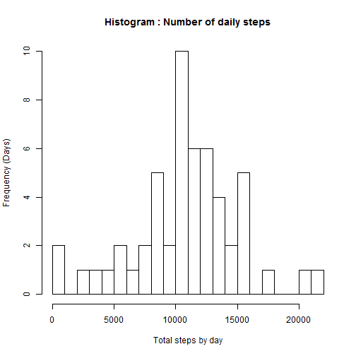
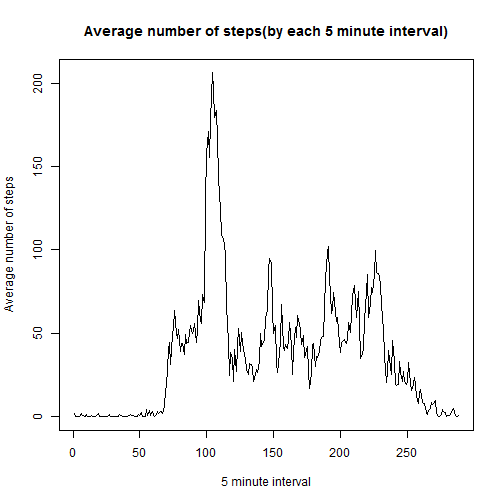
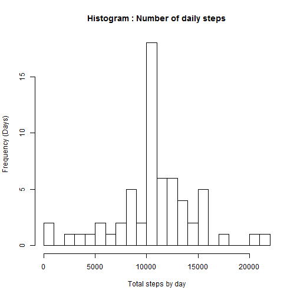
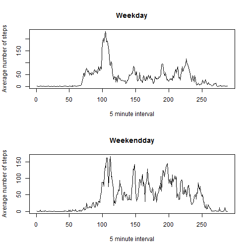

**Loading and preprocessing the data**

unziping the activity.zip file

```r
unzip("activity.zip")
```

reading activity file

```r
activityData <- read.csv("activity.csv")
```

**What is mean total number of steps taken per day?**

Make a histogram of the total number of steps taken each day

```r
StepsByDaySum <- tapply(activityData$steps, activityData$date, sum)
hist(StepsByDaySum, xlab="Total steps by day",ylab="Frequency (Days)",
     main="Histogram : Number of daily steps", breaks=20)
```

 

Calculate and report the mean and median total number of steps taken per day

```r
StepsByDayMean <- mean(StepsByDaySum, na.rm = TRUE)
StepsByDayMean
```

```
## [1] 10766.19
```

```r
StepsByDayMedian <- median(StepsByDaySum, na.rm = TRUE)
StepsByDayMedian
```

```
## [1] 10765
```

**What is the average daily activity pattern?**

Make a time series plot (i.e. type = "l") of the 5-minute interval (x-axis) and 
the average number of steps taken, averaged across all days (y-axis)

```r
StepsByIntervalAvg <- tapply(activityData$steps, activityData$interval, 
                             mean, na.rm = T)
plot(StepsByIntervalAvg, type = "l", xlab="5 minute interval", 
     ylab="Average number of steps", 
     main="Average number of steps(by each 5 minute interval)")
```

 

Which 5-minute interval, on average across all the days in the dataset, contains the maximum number of steps?

```r
maxStepsInterval <- activityData$interval[which.max(StepsByIntervalAvg)]
maxStepsInterval
```

```
## [1] 835
```

**Imputing missing values**

Calculate and report the total number of missing values in the dataset (i.e. the total number of rows with NAs)

```r
NoOfRowsWithNA <- sum(is.na(activityData))
NoOfRowsWithNA
```

```
## [1] 2304
```

Devise a strategy for filling in all of the missing values in the dataset. 
**For replacing missing values in the dataset, we use mean for that 5-minute interval**


Create a new dataset that is equal to the original dataset but with the missing data filled in.

```r
newActivityData <- activityData 
StepsByInterval_Mean <- tapply(newActivityData$steps, newActivityData$interval, 
                               mean, na.rm = T)
newActivityData$steps[is.na(newActivityData$steps)] <- StepsByInterval_Mean
```

Make a histogram of the total number of steps taken each day and Calculate and report the mean and median total number of steps taken per day. Do these values differ from the estimates from the first part of the assignment? What is the impact of imputing missing data on the estimates of the total daily number of steps?

```r
newStepsByDaySum <- tapply(newActivityData$steps, newActivityData$date, sum)
hist(newStepsByDaySum, xlab="Total steps by day",ylab="Frequency (Days)", 
     main="Histogram : Number of daily steps", breaks=20)
```

 

finding mean

```r
newStepsByDayMean <- mean(newStepsByDaySum)
newStepsByDayMean
```

```
## [1] 10766.19
```

finding median

```r
newStepsbyDayMedian <- median(newStepsByDaySum)
newStepsbyDayMedian
```

```
## [1] 10766.19
```

**It is observed that, the mean value is unchanged while median value is different from the estimates from the first part of the assignment**

**After imputing missing data, the estimates of the total daily number of steps i.e. mean and median are observed to be same.**


**Are there differences in activity patterns between weekdays and weekends?**


```r
newActivityData$date <- as.Date(as.character(newActivityData$date, 
                                             format = "%Y%m%d"))
newActivityData$day <- weekdays(newActivityData$date)
newActivityData$day[newActivityData$day == "Saturday" | 
                    newActivityData$day == "Sunday"] <- "weekend"
newActivityData$day[newActivityData$day == "Monday" | 
                    newActivityData$day == "Tuesday" |
                    newActivityData$day == "Wednesday" |
                    newActivityData$day == "Thursday" |
                    newActivityData$day == "Friday"] <- "weekday"
newActivityData$day <- as.factor(newActivityData$day)


newActivityDataWeekday <- subset(newActivityData, day == "weekday")
newActivityDataWeekEndday <- subset(newActivityData, day == "weekend")

newStepsByIntervalMeanWeekday <- tapply(newActivityDataWeekday$steps, 
                                        newActivityDataWeekday$interval, mean)
newStepsByIntervalMeanWeekEndday <- tapply(newActivityDataWeekEndday$steps, 
                                        newActivityDataWeekEndday$interval, 
                                        mean)
```

plotting graph

```r
par(mfrow = c(2, 1))
plot(newStepsByIntervalMeanWeekday, 
     type = "l", main = "Weekday", 
     xlab="5 minute interval", ylab="Average number of steps")
plot(newStepsByIntervalMeanWeekEndday, 
     type = "l", main = "Weekendday", 
     xlab="5 minute interval", ylab="Average number of steps")
```

 
